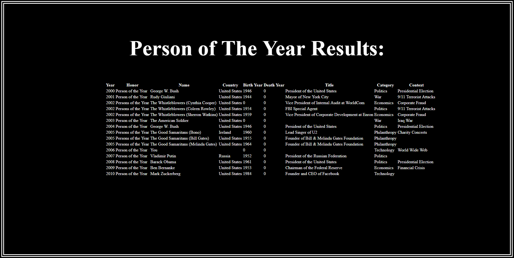

<h1> MVC Core </h1>

<h2> Summary </h2>

This web application requires the user to input two dates. A start year and an end year.  Once the user enters those two 4 digit numbers 
into the directed fields and the user click send data the user is then redirected to a data collection page.  Here we display every 
person of the year award winner between the two selected years inputed by the user.

<h5>Main Page </h5>

<h5>Results Page </h5>

<h2> Setup </h2>

1. Clone this repo, "MVC_Core".
2. In the repository, open "MVC_Core.sln" is VS Community.
3. In the Debug menu, press "Start without debugging".
4. Enter a starting year and ending year and then press send data button.
